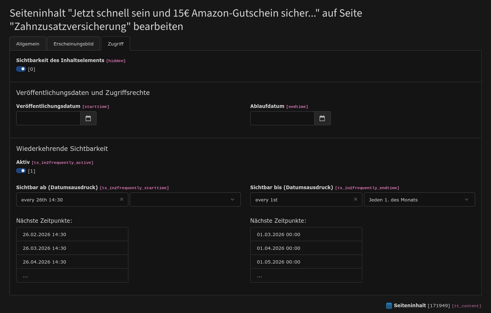

# in2frequently - Recurring visibility windows for content elements in TYPO3

## Introduction

This TYPO3 extension adds recurring, time-based visibility windows to content elements. Unlike TYPO3's
built-in start/endtime (which is a one-time date range), in2frequently uses **cron-style expressions** to
define repeating visibility patterns — for example: *show this content element every month from the 1st to
the 15th*, or *show it every Friday afternoon until Monday morning*.

The extension is built on natural language cron expressions and integrates transparently into the existing
TYPO3 access palette in the backend.

Example integration in backend


## How it works

Each content element can optionally be extended with three fields in the **Recurring Visibility** palette:

| Field                               | Description                                                |
|-------------------------------------|------------------------------------------------------------|
| **Active**                          | Enables recurring visibility control for this element      |
| **Visible from (date expression)**  | Cron expression defining when the visibility window opens  |
| **Visible until (date expression)** | Cron expression defining when the visibility window closes |

At render time, the extension compares the current timestamp against the most recent and next occurrence
of both expressions:

- The content element is **visible** if the last start event is more recent than the last stop event
  (i.e. a window was opened and has not yet been closed)
- The content element is **hidden** otherwise

Both fields accept natural language expressions (see [Expression Syntax](#expression-syntax) below).
Leaving a field empty disables that side of the restriction.

## Installation

```
composer req in2code/in2frequently
```

No further configuration is required. The extension registers its event listeners and middleware
automatically via `Services.yaml` and `RequestMiddlewares.php`.

## Backend Integration

The **Recurring Visibility** palette is injected into the access tab of every content element type
automatically. It appears directly after the standard TYPO3 access palette.

Enable the toggle to reveal the two expression fields. A preview wizard shows the **next three upcoming
dates** for each expression as you type, along with the resolved cron string — making it easy to verify
the expression before saving.

## Expression Syntax

Expressions follow the natural language format provided by `bentools/natural-cron-expression`. The
following patterns are supported:

| Expression              | Meaning                         |
|-------------------------|---------------------------------|
| `every day`             | Daily at midnight (00:00)       |
| `every day at 3 AM`     | Daily at 03:00                  |
| `every 1st`             | 1st of every month at midnight  |
| `every 15th`            | 15th of every month at midnight |
| `every 27th`            | 27th of every month at midnight |
| `every 27th midnight`   | 27th of every month at 00:00    |
| `every 1st at 8am`      | 1st of every month at 08:00     |
| `every 15th at 8am`     | 15th of every month at 08:00    |
| `every friday at 17:00` | Every Friday at 17:00           |

Standard cron syntax (e.g. `0 8 1 * *`) is also accepted.

### Example: monthly content from 1st to 15th

| Field         | Value        |
|---------------|--------------|
| Visible from  | `every 1st`  |
| Visible until | `every 15th` |

### Example: weekly content from Friday evening to Monday morning

| Field         | Value                   |
|---------------|-------------------------|
| Visible from  | `every friday at 17:00` |
| Visible until | `every monday`          |

## Cache Integration

The extension ships a PSR-15 middleware (`FrequentlyCacheMiddleware`) that restricts the frontend page
cache lifetime to the timestamp of the next visibility change. This ensures that content transitions
(element appearing or disappearing) are reflected on the live site without manual cache clearing.

The middleware runs after `staticfilecache/generate`, so **lochmueller/staticfilecache** is fully
supported. When staticfilecache is installed, it is recommended to require it:

```
composer req lochmueller/staticfilecache
```

## Local Development

The extension ships a [DDEV](https://ddev.readthedocs.io) configuration for a self-contained local
TYPO3 environment. It sets up a full TYPO3 13.4 instance with a demo page and a content element so
you can test the extension immediately after initialization.

### Prerequisites

- [DDEV](https://ddev.readthedocs.io/en/stable/users/install/ddev-installation/) installed
- Docker running

### First-time setup

```bash
ddev start
ddev initialize
```

`ddev initialize` installs Composer dependencies, runs the TYPO3 setup wizard, applies the DDEV
configuration, imports the demo database content, and flushes caches. It takes about a minute.

After initialization:

|                        | URL                                     |
|------------------------|-----------------------------------------|
| **Backend**            | https://in2frequently.ddev.site/typo3   |
| **Frontend demo page** | https://in2frequently.ddev.site/example |
| **Login**              | `admin` / `admin`                       |

### Daily workflow

```bash
ddev start          # start containers
ddev stop           # stop containers
ddev typo3 cache:flush                  # flush TYPO3 cache
ddev typo3 database:updateschema        # apply DB schema changes after TCA edits
```

### Persisting content changes

After making content changes in the backend that should be shared with other developers, export
the database and commit the result:

```bash
ddev createdumpfile   # exports to .ddev/data/demo.sql
git add .ddev/data/demo.sql
```

## Changelog

| Version | Date       | State  | Description                                                                                 |
|---------|------------|--------|---------------------------------------------------------------------------------------------|
| 2.0.1   | 2026-03-25 | Bugfix | Fix problem with not available dates like "every 30th" even if there is no 30th in february |
| 2.0.0   | 2026-03-25 | Task   | Add a local environment for better contribution (DDEV), support cron strings now            |
| 1.0.0   | 2026-03-11 | Task   | Initial release                                                                             |
